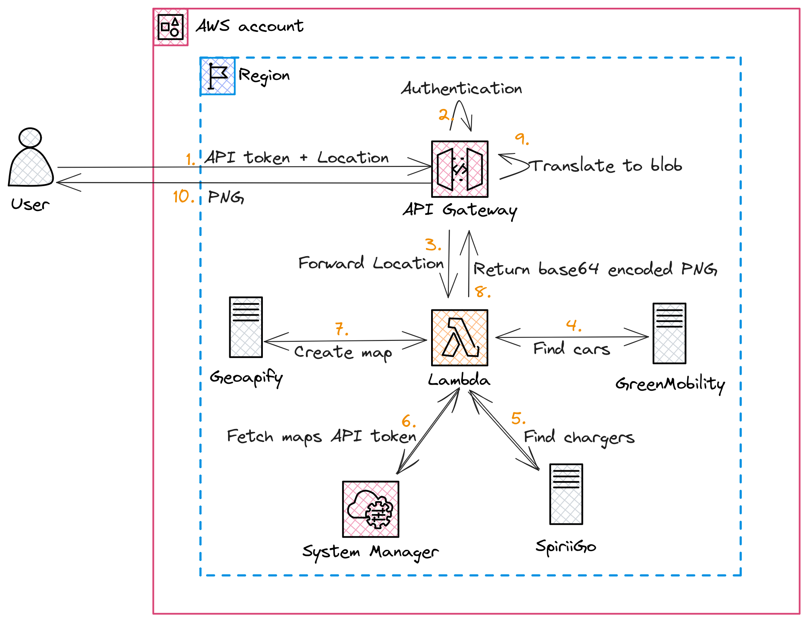

# Greenmobility Stalker

## Project Description:

This project aims to create an API that serves as a proxy to the functionality provided by [Greenmobility](https://www.greenmobility.com). When a Greenmobility car is placed on a charger while low on battery, users receive free driving minutes.

### Diagram:

### Initial Iteration:

The first iteration of this project utilized a cronjob running on [GCP](https://console.cloud.google.com) and was deployed using [Terraform](https://www.terraform.io). A [Cloud Scheduler](https://cloud.google.com/scheduler/) triggered a [Cloud Function](https://cloud.google.com/functions) (version 2) which queried the Greenmobility API for cars at a specific location. The function filtered the cars with low battery and generated a map using the [Google Static Maps API](https://developers.google.com/maps/documentation/maps-static/overview). The map displayed locations where cars could be charged for free minutes. The generated image was then sent to the [Pushover](https://pushover.net) application and displayed on my phone. Sensitive information, such as tokens, were stored securely in [Secret Manager](https://cloud.google.com/secret-manager).

### New Iteration:

The latest iteration of this project introduced significant changes to the deployment and functionality. The project is now deployed on [AWS](https://aws.amazon.com) using the [AWS CDK](https://docs.aws.amazon.com/cdk/api/v2/). The user interacts with an [API Gateway](https://aws.amazon.com/api-gateway/) protected by a [Usage Plan](https://docs.aws.amazon.com/apigateway/latest/developerguide/api-gateway-api-usage-plans.html) that requires an API token for authentication. Once authenticated, the API Gateway triggers a [Lambda function](https://docs.aws.amazon.com/lambda/latest/dg/welcome.html). The Lambda function determines the location to query, executes the request against the Greenmobility API, filters the cars that can be charged, and generates a static image using the [Geoapify Static Maps API](https://www.geoapify.com/static-maps-api). The image is returned as the response body from the Lambda function. Sensitive information is stored securely in the [SSM Parameter Store](https://docs.aws.amazon.com/systems-manager/latest/userguide/systems-manager-parameter-store.html).

### Calling the API from Various Devices:

The API Gateway can be accessed from different devices, including iPhones using the [Shortcuts](https://support.apple.com/en-gb/guide/shortcuts/welcome/ios) app. Apple shortcuts provide powerful automation capabilities, such as detecting when a user is returning home and querying for available cars to charge in the surrounding area. Additionally, simple cronjobs can be set up in the *Shortcuts* in a way, that the request is only executed when the user is in the correct location.

### Reasoning:

Several factors influenced my decision to make certain changes in the project:

1. Moving away from GCP: I chose to shift away from GCP due to concerns regarding their billing practices and the lack of transparency in understanding the charges associated with specific resources. Additionally, GCP lacks a comparable tool to AWS CDK, which I found preferable for handling deployments. The AWS CDK's ability to write infrastructure using a programming language allows for faster iterations and, in my opinion, improves code readability, especially on shorter projects.

2. Transition from Terraform to AWS CDK: I made the decision to switch from Terraform to AWS CDK because I find writing infrastructure in a programming language more intuitive, especially on smaller projects. This change allows for faster iterations and simplifies the development process.

3. Choice of storing secrets: Instead of utilizing [Secrets Manager](https://docs.aws.amazon.com/secretsmanager/latest/userguide/intro.html) to store secrets, I opted for using [SSM Parameter Store](https://docs.aws.amazon.com/systems-manager/latest/userguide/systems-manager-parameter-store.html). This decision was driven by cost considerations, as SSM Parameter Store is less expensive than Secrets Manager. Additionally, since the secrets I'm dealing with don't require the extra protection provided by Secrets Manager, I found Parameter Store to be a suitable and more cost-effective alternative.

4. Switching to Geoapify Static Maps API: I transitioned from using Google Maps Static API to Geoapify Static Maps API due to the requirements imposed by Google. The Google API necessitates attaching a credit card to the account, while Geoapify offers a free tier without the need for credit card details. Moreover, I appreciate that Geoapify utilizes the [OpenStreetMap](https://www.openstreetmap.org/) infrastructure, which adds to its appeal.

